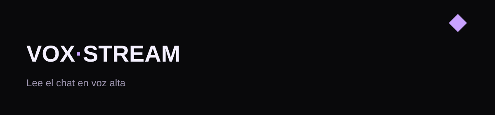

# VoxStream

Lee el chat de Twitch y TikTok en voz alta. Es una web. No hay exe.

VoxStream reads Twitch and TikTok chat out loud. It is a website. There is no exe.

VoxStream Free. Uso gratuito. Paid plans come later.

Sitio: https://yuicoder.github.io/VoxStream/

## Español

Abre el estudio en https://yuicoder.github.io/VoxStream/ y pulsa **Abrir estudio**.
Usa Chrome. No instales nada.

### Twitch
Escribe un canal en directo, sin `#`.
Pulsa **Conectar**. No pide contraseña.

### Voz
Chrome bloquea el audio hasta un clic.
Pulsa **Probar voz** una vez.
La pestaña no puede estar muteada.

### TikTok
El LIVE tiene que estar abierto.
Crea una clave gratis en https://www.eulerstream.com/register
Pégala, pon el usuario sin `@`, pulsa **Conectar**.
Sin clave no hay chat real. **Ensayo** es la demo.

Es Free. No hay exe.

Issues: https://github.com/YuiCoder/VoxStream/issues

## English

Open the studio at https://yuicoder.github.io/VoxStream/ and click **Abrir estudio**.
Use Chrome. Nothing to install.

### Twitch
Type a live channel, no `#`.
Click **Conectar**. No password.

### Voice
Chrome blocks audio until a click.
Press **Probar voz** once.
The tab cannot be muted.

### TikTok
The LIVE must be open.
Get a free key at https://www.eulerstream.com/register
Paste it, type the username without `@`, click **Conectar**.
No key means no real TikTok chat. **Ensayo** is the demo.

It is Free. There is no exe.

Issues: https://github.com/YuiCoder/VoxStream/issues
